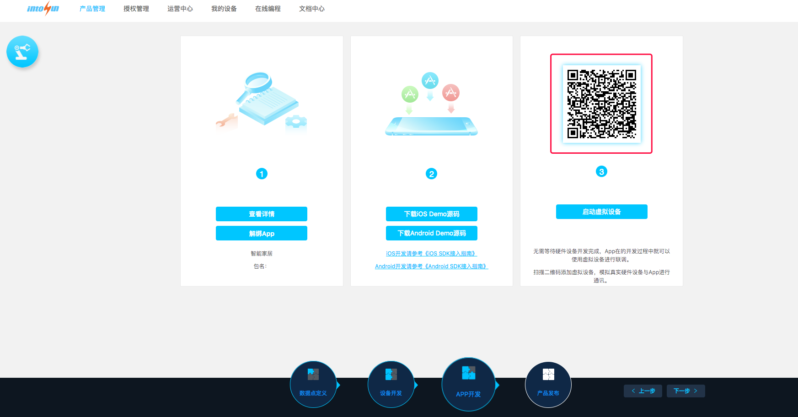

# IntoYunSDKDemo-ios

为了方便第三方开发者快速集IntoYun SDK，我们提供了以下联系方式，协助开发者进行集成：
邮箱：support@intorobot.com
微博：IntoRobot
另外，关于SDK的Bug反馈、用户体验、以及好的建议，请大家尽量提交到 Github 上，我们会尽快解决。
目前，我们正在逐步完善IntoYun SDK，争取为第三方开发者提供一个规范、简单易用、可靠、可扩展、可定制的 SDK，敬请期待。

## 方式一, 快速集成 IntoYunSDK支持使用Cocoapods集成，请在Podfile中添加以下语句：

* 导入IntoYunSDK, 将下面代码添加到Podflie文件中

`pod 'IntoYunSDK', '~> 1.2.0'`

* 设置build setting

在项目target中设置 Build Settings--> Linking -->Other Linker Flags 在后面增加[-ObjC]。(必须添加，否则程序会崩溃)

* 添加相关依赖库, 将下面代码添加到Podflie文件中

```
pod 'AFNetworking', '~> 3.0'    #source     https://github.com/AFNetworking/AFNetworking/
pod 'MQTTClient'                #source     https://github.com/ckrey/MQTT-Client-Framework
pod 'CocoaAsyncSocket'          #source     https://github.com/robbiehanson/CocoaAsyncSocket
pod 'MJExtension'               #source     https://github.com/CoderMJLee/MJExtension/tree/master/MJExtension
pod 'SocketRocket'              #source     https://github.com/facebook/SocketRocket
```

## 方式二，导入静态库
* 将IntoYunSDK.framework 添加到 Linked Frameworks and Libraries 中
在项目target中设置 General--> Linked Frameworks and Libraries, 点击"+"号将当期目录下的"IntoYunSDK.framework" 添加进去。


## App调试：

登录[IntoYun平台](https://www.intoyun.com)，进入**产品管理 -> App开发**如下图所示，打开App二维码扫描功能，即可启动虚拟设备进行app数据点调试。




# 更新记录

### 2017-8-30      v1.2.0 
- 1、增加对[TCP/Websocket协议]*(http://docs.intoyun.com/yunapi/tcp/)的支持

### 2017-7-27      v1.1.2 
- 1、修复配置设备后，设备在线下载程序的bug

### 2017-7-20      v1.1.1
- 1、增加扫描模拟设备二维码，生成调试设备
- 2、修复字符型数据点输入中文错误的bug
- 3、设置透传型数据点16进制字符，输入的字符数一定是偶数个

### 2017-7-8       v1.0.2 已弃用
- 1、增加对LoRa和Gateway网关设备的支持
- 2、更新关联控制设置

### 2017-6-12
- 1、修复SDK静态库头文件缺失bug

### 2017-6-10
- 1、修复获取设备状态功能
- 2、修改数值型数据点发送数据失效的bug
